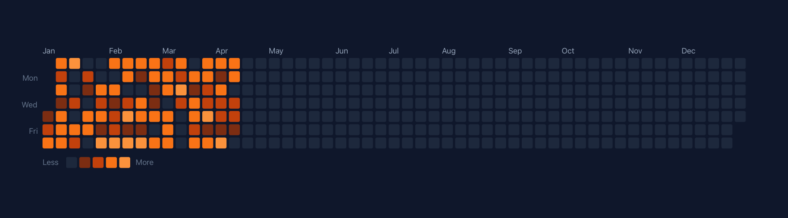
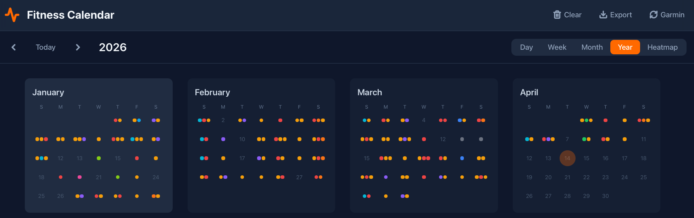

# Fitness Calendar

A self-hosted fitness activity calendar with Garmin live sync, Garmin CSV import fallback, multiple calendar views, body wellness tracking, JSON backup/restore, and optional private Gist export.

Data is stored server-side in SQLite and scoped by the authenticated Caddy username, so multiple users can share the same deployment without mixing activity or body log data.

---

## Screenshots

### Heatmap view



### Year view



---

## How It Works

### Login and user isolation

The production app runs behind Caddy basic auth. Caddy forwards the authenticated username to FastAPI with `X-Remote-User`, and every activity, body log, export, restore, and Garmin sync operation is scoped to that user.

In local development, the Vite proxy injects `X-Remote-User: local-user` so the backend can run without Caddy.

### Garmin live sync

The primary import path is the **Garmin** button in the app header.

1. Click **Garmin**.
2. The frontend calls `POST /api/sync/garmin?days=90`.
3. FastAPI requests recent activities from a configured garmin-bot API.
4. Activities are mapped into Fitness Calendar activity types.
5. Existing records are skipped by Garmin ID and by `date | type | rounded duration` fingerprint.
6. The calendar refreshes with any new activities.

Server-side Garmin sync requires:

```bash
GARMIN_BOT_API_URL=http://localhost:8091
GARMIN_BOT_API_KEY=your_garmin_bot_api_key
```

### Garmin CSV fallback

CSV import is still available when live sync is unavailable or when backfilling older exports:

1. Export `Activities.csv` from Garmin Connect.
2. Click **Import** in the app header.
3. Drag and drop the CSV file, or browse to select it.
4. Preview the parsed activities.
5. Click **Import**.

CSV imports use the bulk import endpoint and skip duplicates by `date | type | duration | start time`.

### Calendar views

Use the toolbar to switch between:

| View | Shows |
|------|-------|
| **Day** | Activities and body logs for one day |
| **Week** | A compact week list |
| **Month** | Calendar grid for training patterns |
| **Year** | All 12 months at once |
| **Heatmap** | GitHub-style activity frequency and duration |

Keyboard shortcuts:

- `Left` / `Right` - navigate previous/next
- `Escape` - zoom out from day to week to month to year to heatmap

### Body wellness log

Click **Body Log** to log pain or discomfort. Entries include a body part, severity from 1-5, and optional notes. Month view shows colored indicators, day view shows full entries, and the side panel summarizes recent body log activity for the visible date range.

### Backup, restore, and Gist sync

- **Export** downloads a JSON backup for the current user.
- **Restore** replaces the current user's data from a JSON backup.
- Optional **Gist sync** writes activities and body logs from `GET /api/export` to a private GitHub Gist for downstream tools.

---

## Features

- Garmin live sync through the backend garmin-bot API
- Garmin CSV import fallback with preview and deduplication
- Day, week, month, year, and heatmap calendar views
- Activity charts on wider screens
- Body wellness tracking with severity and notes
- Server-side SQLite storage with per-user isolation
- JSON backup and restore
- Optional private GitHub Gist export
- Light/dark theme toggle
- GitHub Actions deployment path plus local deploy script

---

## Tech Stack

**Frontend:** React 19, TypeScript, Vite 7, Tailwind CSS, Zustand, Recharts, Framer Motion, date-fns

**Backend:** FastAPI, SQLite via SQLAlchemy, Uvicorn

**Hosting:** Caddy reverse proxy with basic auth, systemd service, GitHub Actions or local deploy script

---

## Local Development

You'll need Node.js 20+ and Python 3.11+ installed.

```bash
# Terminal 1 - backend
cd backend
python3 -m venv venv
source venv/bin/activate
pip install -r requirements.txt
DEV_MODE=true uvicorn main:app --host 127.0.0.1 --port 8001 --reload

# Terminal 2 - frontend
npm install
npm run dev
```

The frontend dev server proxies `/api/*` to `localhost:8001` and injects `X-Remote-User: local-user`.

To test Garmin live sync locally, start the garmin-bot API and run the backend with `GARMIN_BOT_API_URL` and `GARMIN_BOT_API_KEY` set.

Useful commands:

```bash
npm run build
npm run preview
```

---

## Deployment

The app can deploy in two ways:

1. **GitHub Actions** on pushes to `main`.
2. **Local deploy script** with `./deploy.sh [branch]`.

Both paths build frontend assets, deploy `dist/`, update the server checkout from GitHub, install backend dependencies, preserve `data/` and `.env`, and restart the `fitness-calendar` systemd service.

### Local deploy config

Create a gitignored `.deploy-env` at the repo root:

```bash
SERVER=user@your-vps-host
REMOTE=/opt/fitness-calendar
```

Then run:

```bash
# Push current branch, upload built assets, and deploy that branch
./deploy.sh

# Deploy a specific branch
./deploy.sh main

# Skip local push if the branch is already on GitHub
SKIP_PUSH=1 ./deploy.sh main
```

### GitHub Actions auto deploy

`.github/workflows/deploy.yml` deploys automatically on pushes to `main` and supports manual runs.

Required repository secrets:

- `VPS_HOST` - server hostname or IP
- `VPS_USER` - SSH user
- `VPS_SSH_KEY` - private key content used by Actions

One-time key setup:

```bash
ssh-keygen -t ed25519 -f ~/.ssh/github-actions-hetzner -C "github-actions-deploy"
cat ~/.ssh/github-actions-hetzner.pub | ssh <VPS_USER>@<VPS_HOST> 'cat >> ~/.ssh/authorized_keys'
```

Then paste `~/.ssh/github-actions-hetzner` into the `VPS_SSH_KEY` secret.

### Server paths

```text
App dir: /opt/fitness-calendar/
Service: systemctl status fitness-calendar
Logs:    journalctl -u fitness-calendar -f
Caddy:   /etc/caddy/Caddyfile
```

### Caddy users

Generate a password hash on the server:

```bash
caddy hash-password --plaintext "theirpassword"
```

Add the username and hash to the `basicauth` block in `/etc/caddy/Caddyfile`, then reload Caddy:

```bash
sudo systemctl reload caddy
```

See [`deploy/Caddyfile.snippet`](deploy/Caddyfile.snippet) for a template.

### Database migrations

Run migration scripts manually on the server before deploying backend code that changes the schema:

```bash
DATABASE_URL=sqlite:////opt/fitness-calendar/data/fitness.db \
MIGRATION_DEFAULT_USER=existing_username \
python3 backend/migrate_add_user_id.py
```

---

## GitHub Gist Sync

The app can push the current user's export data to a private GitHub Gist for external tools.

Setup:

1. Create a GitHub token with `gist` scope.
2. Create a private gist with one file named `fitness_data.json`.
3. Add the Vite env vars:

   ```bash
   VITE_GITHUB_TOKEN=your_gist_token_here
   VITE_FITNESS_GIST_ID=your_gist_id_here
   ```

Notes:

- Sync writes `activities` and `bodyLogs` from the backend export.
- Existing extra keys in the gist are preserved.
- Activities and body logs are sorted newest first.
- If reading existing gist content fails in-browser, sync still pushes the exported fitness data.

---

## Privacy And Public Repo Notes

Do not commit production `.env`, `.deploy-env`, SQLite databases, Garmin CSV exports, JSON backups, real Caddy password hashes, private Gist IDs, API keys, or screenshots that expose personal health data.

The tracked examples use placeholders. Local data files are ignored by `.gitignore`.

---

## Project Structure

```text
src/
├── types/           # TypeScript types
├── lib/
│   ├── api.ts       # API client for /api/*
│   ├── storage.ts   # JSON backup helpers
│   ├── gistSync.ts  # Private Gist sync
│   └── dateUtils.ts # date-fns wrappers
├── store/
│   └── activityStore.ts
├── hooks/
│   ├── useActivities.ts
│   ├── useBodyLogs.ts
│   ├── useCalendarNavigation.ts
│   ├── useCurrentUser.ts
│   └── useChartData.ts
└── components/
    ├── calendar/
    ├── body/
    ├── charts/
    ├── import/
    ├── layout/
    └── ui/

backend/
├── main.py          # FastAPI app and API routes
├── models.py        # SQLAlchemy models
├── database.py      # DB engine and session
└── migrate_*.py     # One-time migration scripts

deploy/
├── Caddyfile.snippet
├── fitness-calendar.service
├── server-deploy.sh
└── setup.sh
```
